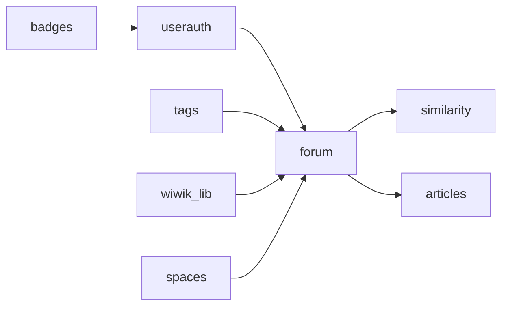

# Project structure

## Django-Apps dependency graph for creating database tables

For generating the models:

- [wiwik_lib](wiwik_lib.md) django-app introduces some helper models used in the main forum app.
- [userauth](userauth.md) handles everything related to user management, authentication, etc.
  - [badges](badges.md) handles calculating whether users merit badges.
- [tags](tags.md) handles tags.
- [spaces](spaces.md) handles sub-communities.
- [forum](forum.md) is the main Q&A app.
- [articles](articles.md) is an extension for forum for handling knowledge articles (non question posts).
- [similarity](similarity.md) enables comparison between different questions
