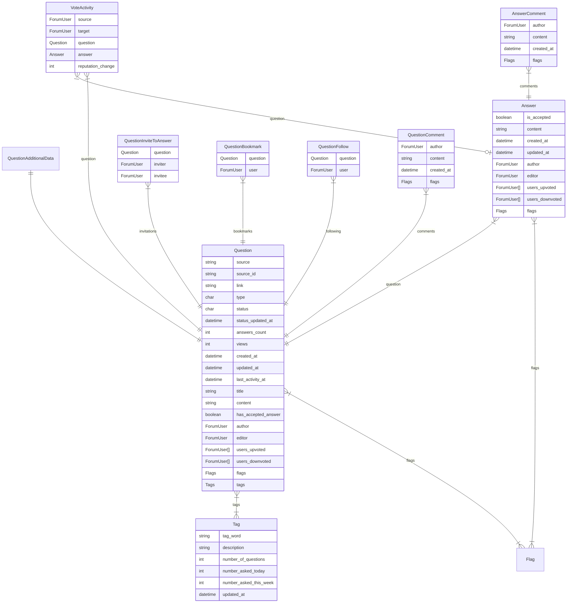

# Project structure

## Django-Apps dependency grapth for creating database tables

For generating the models:

## Database model: Question focus

## Database models: User focus

## Dependencies for views

WIP