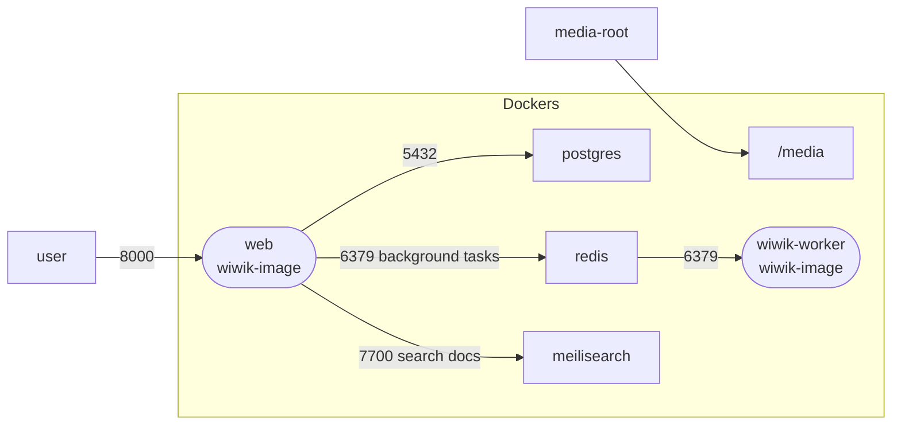
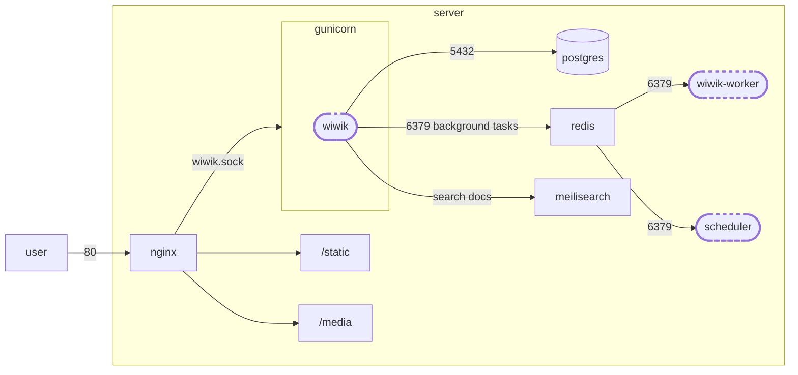

# Deployment guide

## Using helm-chart

Work in progress.

## Using container images

wiwik comes with `docker-compose.yml` which contains all requirements to run
wiwik as containers.

### Services in docker-compose



Dependent services:

- `db` - postgres database
- `redis` - redis database

wiwik services:

- `wiwik-image` - will build an image with all source code of wiwik, does not
  run.
- `migrate` - postgres database migrations job.
- `web` - will run exposing port 8000
- `rqworker` - Run async tasks

## Deployment to server

Instructions are for deployment to debian style server (ubuntu).



### Setup database (postgres)

Install postgres and redis by running:

```bash
sudo apt update
sudo apt install postgresql postgresql-contrib
sudo apt install redis
```

Test that postgres is working properly:

1. changing to `postgres` user: `sudo -i -u postgres`
2. Entering postgres command line client: `psql`
3. Exit client by typing: `\q`

Create a database in postgres by:

* Create a new user: `createuser --interactive`
* create a new database: `createdb devbb`
* Install `pg_trgm` on the created database:

```
psql -U <DB_USERNAME>
\c <DB_NAME>
CREATE EXTENSION pg_trgm;
```

* Restore database backup

```shell
psql --file=scripts/backup_2021-11-06__00-00-01.sql --username=devbb --host=localhost --port=5432 devbb
```

### Setup meilisearch

Install meilisearch locally:

```bash
sudo apt update
sudo apt install curl -y
curl -L https://install.meilisearch.com | sh
chmod +x meilisearch

```

#### Configure it as a daemon

Create a meilisearch user and relevant directories:

```bash
sudo mv ./meilisearch /usr/local/bin/
sudo useradd -d /var/lib/meilisearch -b /bin/false -m -r meilisearch
sudo mkdir /var/lib/meilisearch/data /var/lib/meilisearch/dumps /var/lib/meilisearch/snapshots
sudo chown -R meilisearch:meilisearch /var/lib/meilisearch
sudo chmod 750 /var/lib/meilisearch
```

Create a configuration file `/etc/meilisearch.toml`.
You can use the template in the repo under `config/template/meilisearch.config.toml`.

Update the values in the configuration file:

```toml
env = "production"
master_key = "YOUR_MASTER_KEY_VALUE"
db_path = "/var/lib/meilisearch/data"
dump_dir = "/var/lib/meilisearch/dumps"
snapshot_dir = "/var/lib/meilisearch/snapshots"
```

Create a meilisearch service file `/etc/systemd/system/meilisearch.service`:

```unit file (systemd)
[Unit]
Description=Meilisearch
After=systemd-user-sessions.service

[Service]
Type=simple
WorkingDirectory=/var/lib/meilisearch
ExecStart=/usr/local/bin/meilisearch --config-file-path /etc/meilisearch.toml
User=meilisearch
Group=meilisearch

[Install]
WantedBy=multi-user.target
```

Enable and start the service:

```bash
# Set the service meilisearch
sudo systemctl enable meilisearch

# Start the meilisearch service
sudo systemctl start meilisearch

# Verify that the service is actually running
sudo systemctl status meilisearch
```

More information about running meilisearch can be
found [here](https://www.meilisearch.com/docs/learn/cookbooks/running_production).

### Clone code

- Clone git repo `git clone git@github.com:cunla/wiwik-insiders.git wiwik`
- Install virtualenv `sudo apt install python3-virtualenv`
- Create virtualenv for wiwik from wiwik directory:
  ```shell
  cd wiwik/
  virtualenv -p `which python3.11` env
  ```
- Activate the virtual env and install dependencies
  ```shell
  source env/bin/activate
  pip install poetry
  poetry export --without-hashes --with dev -o requirements.txt
  pip install -r requirements.txt
  rm requirements.txt
  ```

### Create gunicorn service

Under `config/template/gunicorn.service` you can find the default settings
to create a gunicorn service.
Create a copy of this file (preferably create a new context under `config`
directory
and put all configuration there) and edit it.
Then you can copy it for `systemd` usage, so it will be a deamon:

```
sudo cp config/template/gunicorn.service /etc/systemd/system/gunicorn.service
sudo systemctl daemon-reload
sudo systemctl restart gunicorn
```

### Install nginx and point to gunicorn service

Installing nginx depends on your OS, on ubuntu `sudo apt install nginx` works.
(It is recommended to
follow [this guide](https://docs.nginx.com/nginx/admin-guide/installing-nginx/installing-nginx-open-source/)
to install the latest nginx version)

Under `config/template/nginx.django_site.conf` you can find the default settings
for nginx site. Create a copy of this file (preferably create a new context
under `config` directory and put all configuration there) and edit it.

Notice nginx should perform two main functions:

1. Serve static files calls (`/media` or `/static`) directly.
2. Refer to gunicorn for all other calls.

Then copy nginx config to nginx and restart the nginx server.

```
sudo cp $BASE_DIR/config/$CONTEXT/nginx.django_site.conf /etc/nginx/conf.d/django_site.conf
sudo nginx -t # <<< Test configuration before restarting
sudo service nginx restart
```

### Setup rsyslog to collect logs

Set up collecting logs of gunicorn service and rqworker to log files.

```shell
touch ~/rqworker.log
touch ~/gunicorn.log
sudo chown syslog:adm ~/rqworker.log
sudo chown syslog:adm ~/gunicorn.log
chmod 755 ~
sudo cp $BASE_DIR/config/$CONTEXT/rsyslog.gunicorn.conf /etc/rsyslog.d/gunicorn.conf
sudo cp $BASE_DIR/config/$CONTEXT/rsyslog.rqworker.conf /etc/rsyslog.d/rqworker.conf
```

### Setup letsencrypt

Follow [this guide](https://letsencrypt.org/getting-started/).

```shell
sudo apt install snapd
sudo snap install core; sudo snap refresh core
sudo snap install --classic certbot
sudo ln -s /snap/bin/certbot /usr/bin/certbot
sudo certbot certonly --nginx
sudo certbot renew --dry-run
```