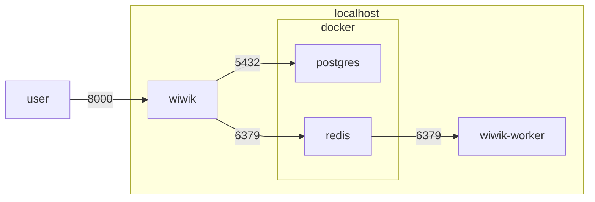

# Local Development Guide

## Prerequisites

- python3.10 or above: (`brew install python3.10` on mac)
- virtualenv  (`sudo pip install virtualenv` on mac)
- redis/docker (to run with async workers)
- postgres (for full-text-search capability)

## Components diagram

Postgres can be replaced with SQLite3 by configuring the `.env` file.



## Step by step

A step by step series of examples that tell you how to get a development env
running locally:

1. clone repository

    ```
    git clone https://github.com/dsoftwareinc/wiwik
    ```

2. In the local repository directory, create a virtual environment and activate
   it.

    ```
    virtualenv env -p `which python3.10`
    source env/bin/activate
    ```

3. Install dependencies required for the project

    ```shell
    pip install poetry
    poetry install
    ```

4. create `.env` file with environment variables
   ([a full guide of environment variables](arch/env-vars.md))

=== "Features configuration"

    ```shell
    # Forum settings
    MIN_QUESTION_CONTENT_LENGTH = 15
    MAX_QUESTION_CONTENT_LENGTH = 2000
    MIN_QUESTION_TITLE_LENGTH = 15
    MAX_QUESTION_TITLE_LENGTH = 150
    MAX_ANSWERS_ON_QUESTION = 3
    MAX_COMMENTS = 5
    MIN_COMMENT_LENGTH = 15
    MAX_COMMENT_LENGTH = 250
    QUESTIONS_PER_PAGE = 20
    ALLOW_ANONYMOUS_QUESTION = TRUE
    NUMBER_OF_TAG_EXPERTS = 3
    NUMBER_OF_TAG_RISING_STARS = 3
    TRIGRAM_SEARCH_MIN_RELEVANCE = 0.02
    SPACES_ENABLED = TRUE
    MAX_SIZE_KB_IMAGE_UPLOAD_KB = 512
    ```

=== "Django configuration"

    ```shell
    DEBUG = TRUE # Whether django should be in debug mode or not
    DEBUG_EMAIL_TO = ... # email to send notifications to when in DEBUG mode.

    # Whether async tasks should run in the background or not
    # Notice running in the background requires redis and a worker on
    RUN_ASYNC_JOBS_SYNC = FALSE

    FAVICON_LINK=...
    ALLOWED_REGISTRATION_EMAIL_DOMAINS = example.com # Domains allowed to be logged in

    # General django settings
    SECRET_KEY=MYSECRETKEY
    DJANGO_LOG_LEVEL=DEBUG # log level
    DJANGO_ALLOWED_HOSTS=localhost 127.0.0.1 [::1] # Django settings ALLOWED_HOSTS

    # Database settings, by default sqlite3 will be used if these variables are not set
    SQL_ENGINE=django.db.backends.postgresql
    SQL_DATABASE=devbb
    SQL_USER=devbb
    SQL_PASSWORD=devbb
    SQL_HOST=db
    SQL_PORT=5432

    # Redis Queue settings
    REDIS_HOST=localhost
    REDIS_PORT=6379
    REDIS_DB=0
    REDIS_PASSWORD=

    # Email settings
    # EMAIL_BACKEND='django.core.mail.backends.smtp.EmailBackend' # USE WITH CAUTION!!!
    EMAIL_BACKEND='django.core.mail.backends.console.EmailBackend' # print emails to console
    EMAIL_HOST=smtp.gmail.com
    EMAIL_PORT=...
    EMAIL_HOST_USER=...
    DEFAULT_FROM_EMAIL=...
    EMAIL_HOST_PASSWORD=...
    ```

=== "3rd party"

    ```shell
    GOOGLE_ANALYTICS_KEY="G-..."

    # Settings for login with google/facebook
    GOOGLE_CLIENT_ID = xxx...xxx
    GOOGLE_SECRET_KEY = xxx...xxx
    FACEBOOK_CLIENT_ID = yyy...yyy
    FACEBOOK_SECRET_KEY = XXX...XXX

    # For Slack notifications and bot
    SLACK_APP_ID = ...
    SLACK_CLIENT_ID = .......
    SLACK_CLIENT_SECRET_KEY = ...
    SLACK_SIGNING_SECRET_KEY = ...
    SLACK_VERIFICATION_TOKEN = ...
    SLACK_BOT_TOKEN = ...
    SLACK_NOTIFICATIONS_CHANNEL = "#everything"
    ```

=== "Entire file"

    ```shell
    DEBUG = TRUE # Whether django should be in debug mode or not
    DEBUG_EMAIL_TO = ... # email to send notifications to when in DEBUG mode.

    # Whether async tasks should run in the background or not
    # Notice running in the background requires redis and a worker on
    RUN_ASYNC_JOBS_SYNC = FALSE

    FAVICON_LINK=...
    ALLOWED_REGISTRATION_EMAIL_DOMAINS = example.com # Domains allowed to be logged in

    # Database settings, by default sqlite3 will be used if these variables are not set
    SQL_ENGINE=django.db.backends.postgresql
    SQL_DATABASE=devbb
    SQL_USER=devbb
    SQL_PASSWORD=devbb
    SQL_HOST=db
    SQL_PORT=5432

    # Redis Queue settings
    REDIS_HOST=localhost
    REDIS_PORT=6379
    REDIS_DB=0
    REDIS_PASSWORD=

    # Email settings
    # EMAIL_BACKEND='django.core.mail.backends.smtp.EmailBackend' # USE WITH CAUTION!!!
    EMAIL_BACKEND='django.core.mail.backends.console.EmailBackend' # print emails to console
    EMAIL_HOST=smtp.gmail.com
    EMAIL_PORT=...
    EMAIL_HOST_USER=...
    DEFAULT_FROM_EMAIL=...
    EMAIL_HOST_PASSWORD=...

    # General django settings
    SECRET_KEY=MYSECRETKEY
    DJANGO_LOG_LEVEL=DEBUG # log level
    DJANGO_ALLOWED_HOSTS=localhost 127.0.0.1 [::1] # Django settings ALLOWED_HOSTS
    GOOGLE_ANALYTICS_KEY="G-..."

    # Settings for login with google/facebook
    GOOGLE_CLIENT_ID = xxx...xxx
    GOOGLE_SECRET_KEY = xxx...xxx
    FACEBOOK_CLIENT_ID = yyy...yyy
    FACEBOOK_SECRET_KEY = XXX...XXX

    # For Slack notifications and bot
    SLACK_APP_ID = ...
    SLACK_CLIENT_ID = .......
    SLACK_CLIENT_SECRET_KEY = ...
    SLACK_SIGNING_SECRET_KEY = ...
    SLACK_VERIFICATION_TOKEN = ...
    SLACK_BOT_TOKEN = ...
    SLACK_NOTIFICATIONS_CHANNEL = "#everything"

    # Forum settings
    MIN_QUESTION_CONTENT_LENGTH = 15
    MAX_QUESTION_CONTENT_LENGTH = 2000
    MIN_QUESTION_TITLE_LENGTH = 15
    MAX_QUESTION_TITLE_LENGTH = 150
    MAX_ANSWERS_ON_QUESTION = 3
    MAX_COMMENTS = 5
    MIN_COMMENT_LENGTH = 15
    MAX_COMMENT_LENGTH = 250
    QUESTIONS_PER_PAGE = 20
    ALLOW_ANONYMOUS_QUESTION = TRUE
    NUMBER_OF_TAG_EXPERTS = 3
    NUMBER_OF_TAG_RISING_STARS = 3
    TRIGRAM_SEARCH_MIN_RELEVANCE = 0.02
    SPACES_ENABLED = TRUE
    MAX_SIZE_KB_IMAGE_UPLOAD_KB = 512

    ```

5. To use search functionality, your database should be postgres. You
   can run a local container with
   postgres: `docker-compose up db`, it will create a local directory from where
   you run it with postgres data. Postgres
   can be replaced with SQLite3 in `.env` file (comment `SQL_*` variables)

6. Use the `reset.sh` script to create stub data. The `reset.sh` script assume
   sqlite3 database.
   ```
   source scripts/reset.sh
   ```
7. That's it, you are ready to run the server. Change directory to `forum` (
   under the repository base directory) and run the django server. The server
   is running by default on port 8000 so you in your browser
   to `localhost:8000`.
   ```shell
   cd forum/
   python manage.py runserver
   ```

8. To test background worker and scheduler as well, redis should be setup and worker should be run. To run redis docker,
   you can use the docker-compose command: `docker-compose up redis db` (this will run both redis and
   postgres).
   Then you can run another process with a worker:
   ```shell
   cd forum/
   python manage.py rqworker
   ```
   Alternatively, you can use the scripts `rqworker.sh` and `rqscheduler.sh` to start these.

9. To enable google auth, replace the `GOOGLE_CLIENT_ID`
   and `GOOGLE_SECRET_KEY` in `.env` file with your google app oauth client ID.
   For more details how, you can
   follow [this tutorial](https://whizzoe.medium.com/in-5-mins-set-up-google-login-to-sign-up-users-on-django-e71d5c38f5d5)
   Only step 7 is required.

   Run a management command to create social apps in the database after setting environment variables:
   ```
   python manage.py create_social_apps
   ```
