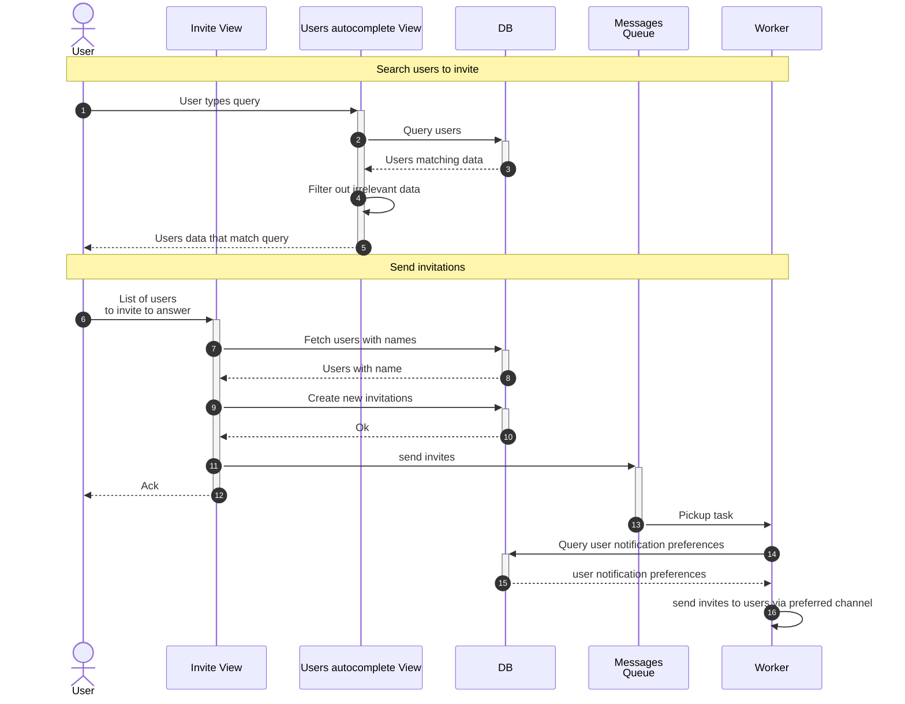

# Invite to answer post

A user can invite another user to answer a post with no accepted answer.

That user will be notified when they are invited (via email/slack).

## Sequence diagram

```mermaid
sequenceDiagram
    autonumber
    actor user as User
    participant invite as Invite View
    participant autocomplete as Users autocomplete View
    participant db as DB
    participant mq as Messages <br> Queue
    participant worker as Worker
    
    note over user,worker: Search users to invite
    user ->>+ autocomplete: User types query
    autocomplete ->>+ db: Query users
    db -->>- autocomplete: Users matching data
    autocomplete ->> autocomplete: Filter out irrelevant data
    autocomplete -->>- user: Users data that match query
     
    note over user,worker: Send invitations
    user ->>+ invite: List of users<br>to invite to answer
    invite ->>+ db: Fetch users with names
    db -->>- invite: Users with name
    invite ->>+ db: Create new invitations
    db -->>- invite: Ok
    invite ->>+ mq: send invites
    invite -->>- user : Ack
    mq ->>- worker: Pickup task
    worker ->>+ db: Query user notification preferences
    db -->>- worker: user notification preferences
    worker ->>+ worker: send invites to users via preferred channel

```