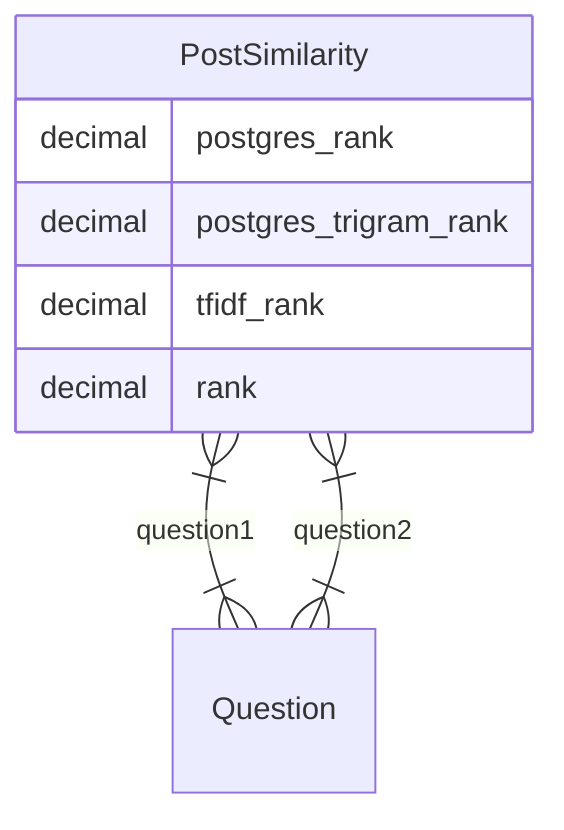

# Posts similarity

When viewing a post, wiwik shows a list of the five most similar posts on the
side.

Similarity is calculated automatically using several methods:

- postgres full text search rank
- trigram distance
- [TF-IDF](https://en.wikipedia.org/wiki/Tf%E2%80%93idf)

Currently only the postgres full-text search rank is taken into account, but
this can be adapted.

## Technical structure

All relevant data is under `forum/similarity` django app.

### Models

#### `PostSimilarity`

A model containing all information about similarity between two posts.

The model can be managed from the admin view.

#### Views
