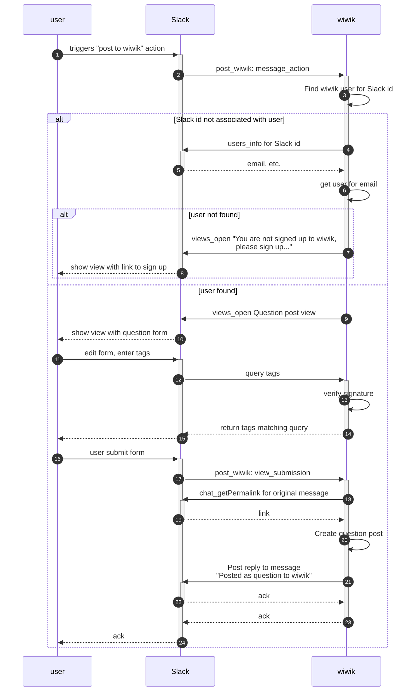

:octicons-heart-fill-24:{ .heart } Sponsors only · :octicons-tag-24: [wiwik-insiders](/wiwik-insiders)

wiwik integrates with Slack for several things:

- Send notifications on certain events, such as send to a channel
  that a new post was published on tag, send post followers
  about a new answer to the post, etc.
- A `Post to wiwik` action button in chosen Slack channels.
  Any user who exists in wiwik can post a Slack message on wiwik without
  leaving Slack.
- Search from Slack: Enabling search wiwik from Slack.

In order to do this, wiwik
uses [Slack-sdk](https://github.com/Slackapi/python-Slack-sdk).

## Slack API used

- [chat_postMessage](https://api.Slack.com/methods/chat.postMessage)
- [users_lookupByEmail](https://api.Slack.com/methods/users.lookupByEmail)
- [users_info](https://api.Slack.com/methods/users.info)
- [chat_getPermalink](https://api.Slack.com/methods/chat.getPermalink)
- [views_open](https://api.Slack.com/methods/views.open)

## Slack app

The Slack application wiwik is using should have the permissions required to use
the
APIs mentioned.

The Slack app has a bot to publish message from - and wiwik needs to set up the
bot
token assosiated with that bot. All calls to Slack API use the bot token.

The Slack app needs to configure interactivity & shortcuts URLs in order to get
the
view to create a post, get a list of tags. The URLs Slack call are not
protected via login/tokens (since Slack can not login to wiwik).
Instead, all incoming requests are verified using `slack_sdk.signature`
generated using `SLACK_SIGNING_SECRET_KEY` which should be set in the
environment variables.

## Post from Slack sequence diagram

## Slack configuration

- Install the [wiwik app](https://api.slack.com/apps/A025ZUFACP7/general?)
- Configure the environment variables: `SLACK_APP_ID`, `SLACK_CLIENT_ID`,
  `SLACK_CLIENT_SECRET_KEY`, `SLACK_SIGNING_SECRET_KEY`,
  `SLACK_VERIFICATION_TOKEN`
- Optionally, configure as well: `SLACK_BOT_TOKEN`,
  `SLACK_NOTIFICATIONS_CHANNEL`, `SLACK_ADMIN_NOTIFICATIONS_CHANNEL`
- Go to [Interactivity & shortcuts](https://api.slack.com/apps/A025ZUFACP7/interactive-messages?)
  and set up the request url to be `https://{your domain}/integrations/slack_post/`
    - Under select menus, set up Options Load URL
      to: `https://{your domain}/integrations/tags_autocomplete/`
- Go to [slash commands](https://api.slack.com/apps/A025ZUFACP7/slash-commands?),
  select `/wiwik` command and in the request URL
  enter: `https://{your domain}/integrations/slack_search/`

