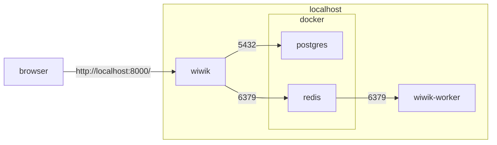

# Local Development Guide

## Prerequisites

- python3.10 or above: (`brew install python3.10` on mac)
- virtualenv  (`sudo pip install virtualenv` on mac)
- redis (in order to run with async workers) - this can be provided as docker container
- postgresql (for full-text-search capability)
    - PostgreSQL can be provided as docker container
    - This is an optional requirement, and can be replaced with sqlite for most development purposes.

## Components diagram

PostgreSQL can be replaced with SQLite3 by configuring the `.env` file.

A sample database with some data is provided.



## Step by step

A step by step series of examples that tell you how to get a development env
running locally:

1. clone repository

    ```
    git clone https://github.com/dsoftwareinc/wiwik
    ```

2. In the local repository directory, create a virtual environment and activate
   it.

    ```
    virtualenv env -p `which python3.10`
    source env/bin/activate
    ```

3. Install dependencies required for the project

    ```
    pip install -r requirements.txt
    ```

4. create `.env` file with environment variables ([a full guide of environment variables](arch/env-vars.md)).

     A sample `.env` file is provided.

5. In order to use search functionality, your database should be postgres. You can run a local container with
   postgres: `docker-compose up db`, it will create a local directory from where
   you run it with postgres data. Postgres can be replaced with SQLite3 in `.env` file (comment `SQL_*` variables)

6. Create all required tables by running migrations:
   ```shell
   cd forum/
   python manage.py migrate
   ```
7. That's it, you are ready to run the server. Change directory to `forum` (
   under the repository base directory) and run the django server. The server
   is running by default on port 8000 so you in your browser
   to `localhost:8000`.
   ```shell
   cd forum/
   python manage.py runserver
   ```

8. In order test background worker and scheduler as well, redis should be setup
   and worker should be run. To run redis docker, you can use the docker-compose
   command: `docker-compose up redis db` (this will run both redis and
   postgres).
   Then you can run another process with a worker:
   ```shell
   cd forum/
   python manage.py rqworker
   ```
   Alternatively, you can use the scripts `rqworker.sh` and `rqscheduler.sh` to
   start these.

9. In order to enable google auth, replace the `GOOGLE_CLIENT_ID`
   and `GOOGLE_SECRET_KEY` in `.env` file with your google app oauth client ID.
   For more details how, you can follow
   [this tutorial](https://whizzoe.medium.com/in-5-mins-set-up-google-login-to-sign-up-users-on-django-e71d5c38f5d5)
   Only step 7 is required.

10. Run a management command to create social apps in the database after setting
    environment variables:
    ``` 
    python manage.py create_social_apps
    ```
